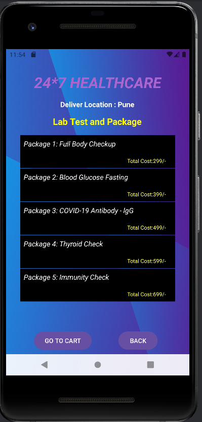
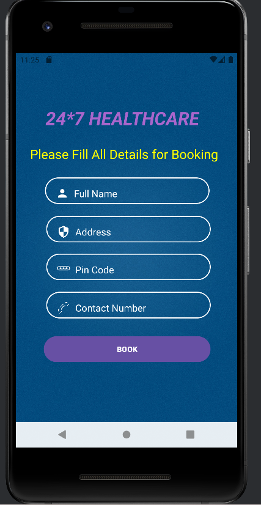

# 24*7 Healthcare Application

## Overview

The "24*7 Healthcare" application is an advanced and comprehensive platform designed to provide healthcare services at any time. This application aims to improve access to healthcare by offering a wide range of functionalities, including user registration, finding specialist doctors, booking laboratory tests, purchasing medications, and accessing health articles. With a user-friendly and intuitive interface, the application helps users manage their healthcare needs effectively and easily.

**Structure and Functionalities**

### 1. Registration and Login

  
  

**Registration**

- **_Purpose:_** Registration ensures that each user has a personal account to access the application's services.
- **_Process:_** The user fills out a form with basic information such as name, email, and password.
- **_Security:_** User data is securely stored using encryption to protect personal information.

**Login**

- **_Purpose:_** Login allows registered users to access their account and use all the application’s features.
- **_Process:_** The user enters their username and password.

### 2. Home Page
The home page contains several cards that serve as entry points for the main functionalities of the application. These cards include:

- **Lab Test**
- **Find Doctor**
- **Buy Medicine**
- **Health Article**
- **Order Details**
- **Logout**

  

### 3. Lab Test

**Description**

- **_Purpose:_** This section allows users to book laboratory tests from a list of available packages.

- **_Packages:_** Packages include tests such as blood tests, general analyses, COVID-19 tests, thyroid tests, etc.

**Booking Process**

- **_Choosing a Package:_** The user selects the test package they wish to take.

- **_Booking:_** The user sets the date and time for the test.

- **_Confirmation:_** After booking, the user receives a confirmation with the details of the booking.

  
  
  

### 4. Find Doctor

**Description**

- **_Purpose:_** This section allows users to search for and book appointments with specialist doctors according to their needs.

**Search and Booking Process**

- **_Search:_** The user can search for specialist doctors such as dentists, cardiologists, family doctors, etc.

- **_Filtering:_** Options to filter doctors by specialization and location.

- **_Booking:_** The user selects the desired doctor and books an appointment by choosing a date and time.

  
  
  

### 5. Buy Medicine

**Description**

- **_Purpose:_** This section allows users to purchase medications from a list of available drugs.

- **_Medication List:_** Users can browse a list of medications, which are categorized and labeled with indications.

**Purchase Process**

- **_Add to Cart:_** The user adds the desired medications to the cart.

- **_Confirmation:_** After ordering, the user receives a success verification toast.

  
  
  
  

### 6. Health Article

**Description**

- **_Purpose:_** This section offers access to various health articles to inform users about different health-related topics.

**Article Structure**

- **_Content:_** Articles contain detailed and scientifically verified information on various health topics.

- **_Images:_** Each article includes an image related to the article’s theme to make the content more engaging and understandable.

### 7. Order Details

**Description**

- **_Purpose:_** This section keeps a record of all the bookings and orders made by the user.

- **_Content:_** Information includes details of laboratory test bookings, medication purchases, and doctor appointments.

**Managing Information**

- **_Viewing History:_** Users can view and manage their order and booking history.

  
  
  

### 8. Logout

**Description**

- **_Purpose:_** This section allows users to log out of their account in the application, ensuring that personal information remains secure.

